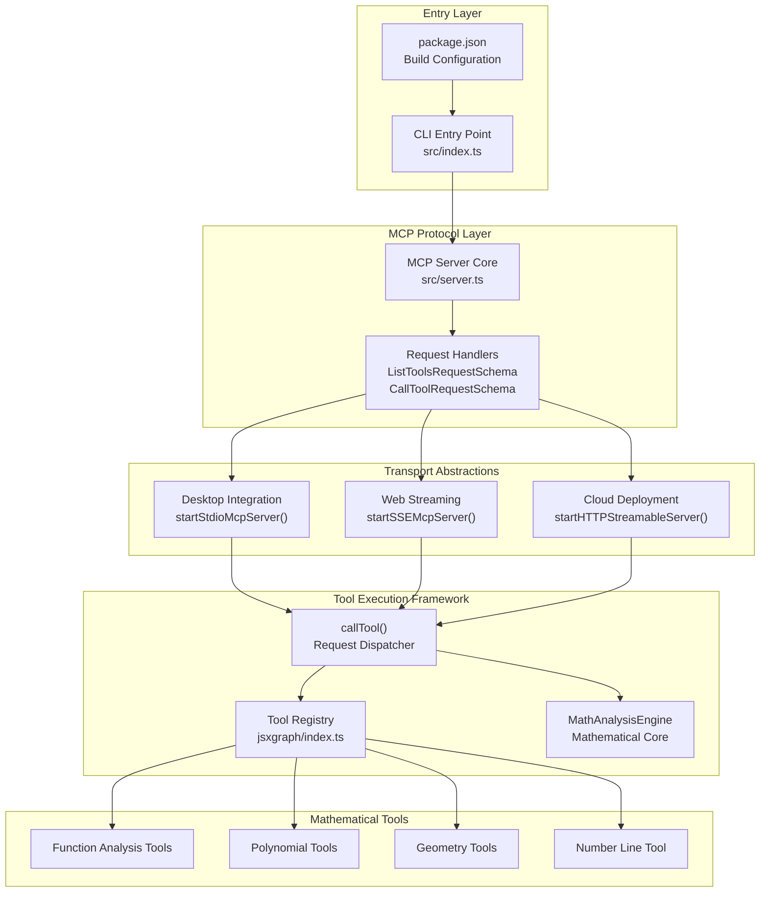
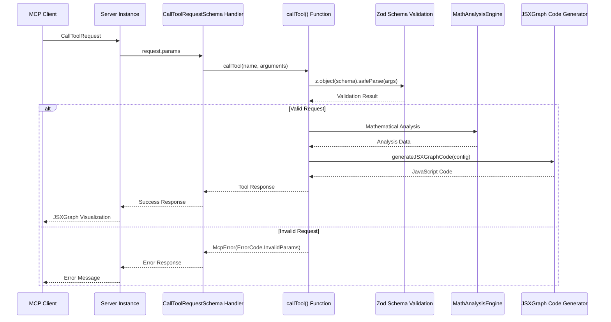
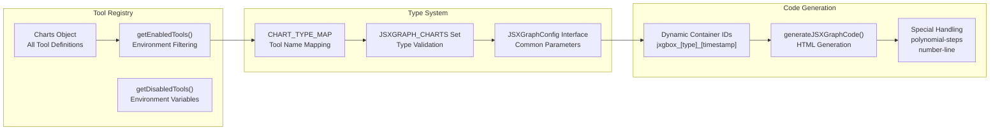
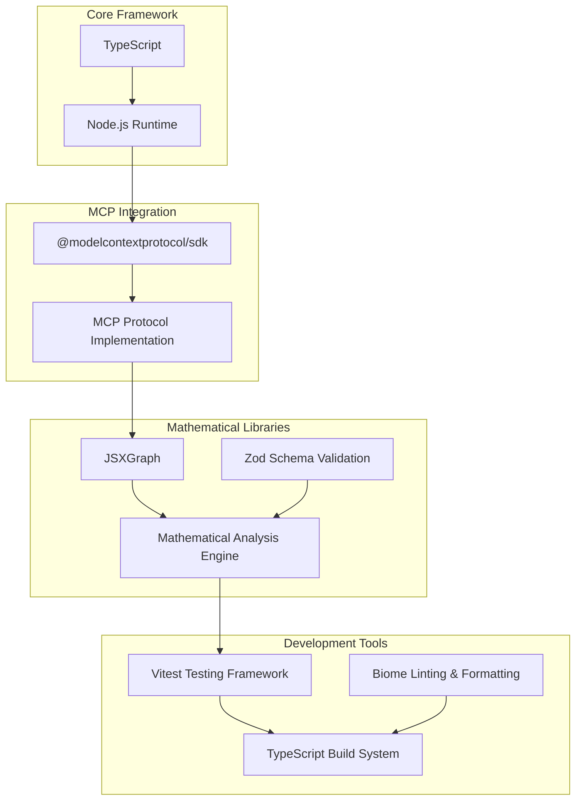

# MCP Server JSXGraph  

**Latest Stable Version: 0.1.2** | **NPM Package: `mcp-server-jsxgraph`**

A Model Context Protocol server for generating mathematical visualizations using [JSXGraph](https://jsxgraph.org/). This MCP server provides interactive mathematical chart generation capabilities for functions, geometry, parametric curves, and educational mathematics.

This is a TypeScript-based MCP server that provides mathematical visualization capabilities. It allows you to create various types of mathematical charts and diagrams through MCP tools, perfect for educational mathematics, engineering, and scientific applications.

## 🚀 Quick Reference

### Transport & Connection Matrix

| Scenario | Command | Listen Port | Access Endpoint | Use Case |
|----------|---------|-------------|-----------------|----------|
| **STDIO (Default)** | `npx -y mcp-server-jsxgraph` | N/A | N/A | Desktop/IDE clients (Claude, Cursor, Cline) |
| **SSE (Local)** | `mcp-server-jsxgraph --transport sse` | 1122 | `http://localhost:1122/sse` | Web streaming applications |
| **Streamable (Local)** | `mcp-server-jsxgraph --transport streamable` | 1122 | `http://localhost:1122/mcp` | HTTP streaming clients |
| **Docker SSE** | `docker compose up -d` (sse service) | 1123 | `http://localhost:1123/sse` | Containerized SSE deployment |
| **Docker Streamable** | `docker compose up -d` (streamable service) | 1122 | `http://localhost:1122/mcp` | Containerized Streamable deployment |

### Minimal Working Configuration

**Desktop Clients (Claude Desktop, Cursor, Cline):**
```json
{
  "mcpServers": {
    "mcp-server-jsxgraph": {
      "command": "npx",
      "args": ["-y", "mcp-server-jsxgraph"]
    }
  }
}
```

**SSE Self-Test (Browser Verification):**
```bash
npx -y mcp-server-jsxgraph --transport sse --port 1122
# Open: http://localhost:1122/sse
```

## 📋 Table of Contents

- [✨ Features](#-features)
- [🏗️ System Architecture](#%EF%B8%8F-system-architecture)
- [🤖 Usage](#-usage)
- [🚰 Run with SSE or Streamable transport](#-run-with-sse-or-streamable-transport)
- [🎮 CLI Options](#-cli-options)
- [⚙️ Environment Variables](#%EF%B8%8F-environment-variables)
- [🔨 Development](#-development)
- [📄 License](#-license)

## ✨ Features

13 mathematical visualization tools powered by JSXGraph for interactive mathematical graphics.

### Mathematical Visualization Charts (JSXGraph)

1. `generate_function_graph`: Generate mathematical function graphs with support for derivatives, integrals, tangent lines, and multiple functions.
2. `generate_parametric_curve`: Generate parametric curves like circles, Lissajous curves, spirals, and cycloids with optional animated traces.
3. `generate_geometry_diagram`: Create interactive geometry diagrams with points, lines, circles, polygons, angles, and geometric constructions.
4. `generate_vector_field`: Visualize 2D vector fields with arrows, streamlines, singular points, and magnitude color coding.
5. `generate_linear_system`: Visualize systems of linear equations and inequalities with feasible regions and linear programming optimization.
6. `generate_function_transformation`: Show function transformations including translations, scaling, reflections, and compositions with animation.
7. `generate_quadratic_analysis`: Comprehensive quadratic function analysis with vertex, roots, axis of symmetry, focus, and directrix.
8. `generate_exponential_logarithm`: Plot exponential and logarithmic functions with asymptotes, growth/decay analysis, and inverse relationships.
9. `generate_rational_function`: Visualize rational and irrational functions with asymptotes, holes, domain restrictions, and critical points.
10. `generate_equation_system`: Solve and visualize linear and nonlinear equation systems with numerical solutions and phase portraits.
11. `generate_conic_section`: Generate conic sections (circles, ellipses, parabolas, hyperbolas) and high-degree polynomials with geometric properties.
12. `generate_polynomial_steps`: Interactive step-by-step polynomial analysis with roots, derivatives, and graphical representations.
13. `generate_number_line_inequality`: Visualize inequalities on number lines with support for simple inequalities (x > 2), compound inequalities (1 < x < 4), and multiple inequality systems with custom styling.

## 🏗️ System Architecture

The MCP Server JSXGraph follows a layered architecture with clear separation between protocol handling, mathematical analysis, and visualization rendering.

### High-Level System Architecture



### Core Components

#### MCP Protocol Implementation
- **Server Core**: Implements Model Context Protocol through `@modelcontextprotocol/sdk`
- **Request Handling**: Supports `ListToolsRequestSchema` and `CallToolRequestSchema`
- **Tool Discovery**: Dynamic tool registration with environment-based filtering
- **Error Management**: Comprehensive error handling with MCP-compliant error codes

#### Transport Layer Support
| Transport | Use Case | Endpoint | Integration |
|-----------|----------|----------|-------------|
| **STDIO** | Desktop applications (Claude, VSCode, Cline, Cursor) | Standard I/O | Direct MCP client integration |
| **SSE** | Web streaming applications | `http://localhost:1122/sse` | Server-sent events |
| **HTTP Streamable** | Cloud deployment platforms | `http://localhost:1122/mcp` | HTTP streaming protocol |

#### Mathematical Analysis Engine
The `MathAnalysisEngine` provides sophisticated mathematical computation capabilities:

- **Function Analysis**: Domain, range, intercepts, extrema, asymptotes, monotonicity
- **Polynomial Analysis**: Root finding, factorization, end behavior analysis  
- **Inequality Solving**: Simple, compound, absolute value, and logical inequalities
- **Numerical Methods**: Bisection method, numerical differentiation, interval calculations

### MCP Protocol Communication Flow



### Tool Execution Framework

The system manages 15+ mathematical visualization tools through a unified execution framework:



### Mathematical Tool Categories

| Category | Tools | Core Capabilities |
|----------|--------|------------------|
| **Function Analysis** | `generate_function_graph`<br/>`generate_function_transformation`<br/>`generate_function_properties` | Function graphs, transformations, comprehensive analysis with derivatives and integrals |
| **Polynomial Analysis** | `generate_polynomial_complete`<br/>`generate_polynomial_steps`<br/>`generate_quadratic_analysis` | Polynomial factorization, root finding, step-by-step analysis |
| **Geometry & Advanced** | `generate_geometry_diagram`<br/>`generate_parametric_curve`<br/>`generate_vector_field`<br/>`generate_conic_section` | Interactive geometry, parametric curves, vector field visualization |
| **Equation Systems** | `generate_linear_system`<br/>`generate_equation_system`<br/>`generate_exponential_logarithm`<br/>`generate_rational_function` | Linear/nonlinear systems, exponential and logarithmic functions |
| **Specialized Tools** | `generate_number_line_inequality` | Enhanced inequality visualization with interval notation |

### Technology Stack



## 🤖 Usage

### Desktop Applications

For desktop MCP clients like Claude Desktop, VSCode, [Cline](https://cline.bot/mcp-marketplace), Cherry Studio, Cursor, use the standard STDIO configuration (see [Quick Reference](#-quick-reference) above).

**Cross-platform configuration (recommended):**
```json
{
  "mcpServers": {
    "mcp-server-jsxgraph": {
      "command": "npx",
      "args": ["-y", "mcp-server-jsxgraph"]
    }
  }
}
```

**Windows-specific (if npx doesn't work directly):**
```json
{
  "mcpServers": {
    "mcp-server-jsxgraph": {
      "command": "cmd",
      "args": ["/c", "npx", "-y", "mcp-server-jsxgraph"]
    }
  }
}
```

## 🚰 Run with SSE or Streamable transport

### Run directly

Install the package globally.

```bash
npm install -g mcp-server-jsxgraph
```

Run the server with your preferred transport option:

```bash
# For SSE transport (default endpoint: /sse)
mcp-server-jsxgraph --transport sse

# For Streamable transport with custom endpoint
mcp-server-jsxgraph --transport streamable
```

Then you can access the server at:

- SSE transport: `http://localhost:1122/sse`
- Streamable transport: `http://localhost:1122/mcp`

### Docker deploy

Enter the docker directory.

```bash
cd docker
```

Deploy using docker-compose.

```bash
docker compose up -d
```

Then you can access the server at:

- SSE transport: `http://localhost:1123/sse`
- Streamable transport: `http://localhost:1122/mcp`

## 🎮 CLI Options

You can also use the following CLI options when running the MCP server. Command options by run cli with `-h`.

```plain
MCP Server JSXGraph CLI

Options:
  --transport, -t  Specify the transport protocol: "stdio", "sse", or "streamable" (default: "stdio")
  --port, -p       Specify the port for SSE or streamable transport (default: 1122)
  --endpoint, -e   Specify the endpoint for the transport:
                   - For SSE: default is "/sse"
                   - For streamable: default is "/mcp"
  --help, -h       Show this help message
```

## ⚙️ Environment Variables

| Variable | Description | Default | Example |
|----------|:------------|---------|---------|
| `DISABLED_TOOLS` | Comma-separated list of tool names to disable | - | `generate_function_graph,generate_parametric_curve` |

### 🎛️ Tool Filtering

You can disable specific mathematical visualization tools using the `DISABLED_TOOLS` environment variable. This is useful when certain tools have compatibility issues with your MCP client or when you want to limit the available functionality.

```json
{
  "mcpServers": {
    "mcp-server-jsxgraph": {
      "command": "npx",
      "args": [
        "-y",
        "mcp-server-jsxgraph"
      ],
      "env": {
        "DISABLED_TOOLS": "generate_function_graph,generate_parametric_curve"
      }
    }
  }
}
```

**Available tool names for filtering:**
- `generate_function_graph`
- `generate_parametric_curve`
- `generate_geometry_diagram`
- `generate_vector_field`
- `generate_linear_system`
- `generate_function_transformation`
- `generate_quadratic_analysis`
- `generate_exponential_logarithm`
- `generate_rational_function`
- `generate_equation_system`
- `generate_conic_section`
- `generate_polynomial_steps`

## 🔒 Compatibility & Stability Promise

**Never Break Userspace Commitment:**
- Published CLI parameters and default behavior will remain stable across minor versions
- Existing transport endpoints (`/sse`, `/mcp`) will not change
- Package name `mcp-server-jsxgraph` will remain consistent
- New features will use new flags/endpoints, leaving existing behavior intact
- Deprecation warnings will provide 2-3 minor version transition periods before removal

**Current Stable APIs:**
- NPM Package: `mcp-server-jsxgraph@0.1.2`
- CLI Arguments: `--transport`, `--port`, `--endpoint` 
- STDIO Transport: Default behavior for desktop clients
- SSE Endpoint: `/sse` on specified port
- Streamable Endpoint: `/mcp` on specified port
- Environment Variables: `DISABLED_TOOLS`

## 🔨 Development

Install dependencies:

```bash
npm install
```

Build the server:

```bash
npm run build
```

Start the MCP server:

```bash
npm run start
```

## 📄 License

MIT@[dxd214](https://github.com/dxd214).
